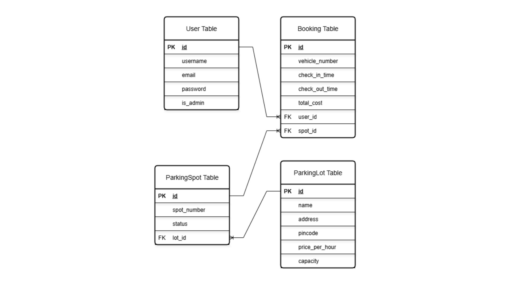

# Park Easy - Vehicle Parking App

**MAD 1 Project - IITM BS Degree Program**  

- **Student Name:** Pranay Aggarwal  
- **Student Roll Number:** 24F3004524  
- **Term:** May 2025  

Park Easy is a multi-user web application designed to manage parking lots and streamline the process of booking a parking spot. It features distinct roles for an administrator, who manages the entire system, and for users, who can register, book, and manage their parking sessions.

This project was developed as part of the Modern Application Development 1 course.

**Project Report:** https://docs.google.com/document/d/1LRyOGXDZTy6jazNFcO-UsDHHw7BRRhjs-9YZh0UIVRg/edit?usp=sharing

## Features

### Admin

  * **Secure Login:** Predefined admin account with no public registration.
  * **Lot Management:** Create, edit, and delete parking lots, including setting their capacity and price.
  * **Spot Management:** Parking spots are automatically created based on a lot's capacity. Admins can view the status of every spot in a detailed grid view.
  * **Live Occupancy View:** See which spots are occupied and which user has booked them in real-time.
  * **User Oversight:** View a complete list of all registered users.
  * **Booking History:** View a comprehensive history of all bookings made across the platform.
  * **Data Visualization:** Access summary charts showing overall spot occupancy and a breakdown per lot.

### User

  * **Account Management:** Simple and secure user registration and login.
  * **Dashboard:** A personalized dashboard that shows a list of available parking lots and displays the status of all active bookings.
  * **Multi-Booking:** Users can book multiple parking spots simultaneously.
  * **One-Click Booking:** Book a spot in an available lot with a single click after providing a vehicle number. The system automatically allocates the first available spot.
  * **Release & Payment:** Easily release a parked spot. The system automatically calculates the duration and total cost.
  * **Parking History:** View a detailed history of all past parking sessions, including duration and cost.
  * **Personal Summary:** Access personal charts visualizing parking habits, such as money spent and visits per lot.
## ER Diagram

## Tech Stack

  * **Backend:** Flask
  * **Frontend:** HTML, CSS, JavaScript, Jinja2
  * **Database:** SQLite, SQLAlchemy
  * **Visualization:** Chart.js

## Setup and Installation

Follow these steps to get the application running on your local machine.

- python -m venv venv
- .\venv\Scripts\activate (windows) or . venv/Scripts/activate (git bash)
- pip install -r requirements.txt
- python setup_db.py
- flask run : click on the localhost provided
